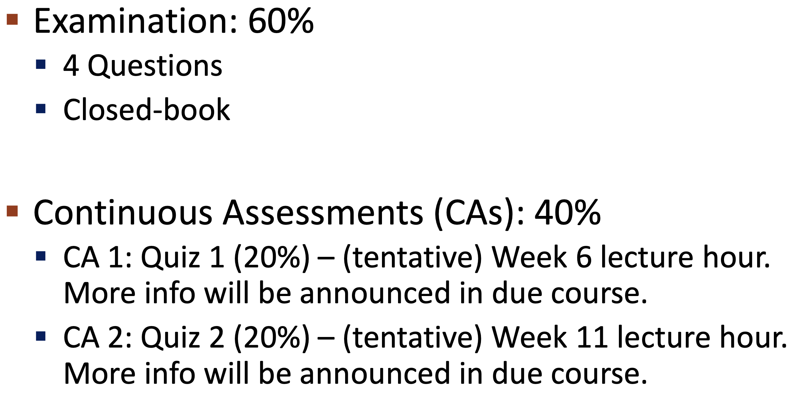

# 课程评分

- **期末考试**：60%  
- **持续评估（Continuous Assessments）**：40%

| 考核项目 | 占比 | 时间安排（暂定） | 备注 |
|----------|------|----------------|------|
| **期末考试** | **60%** | 待定 | 闭卷考试，共 **4 道大题** |
| **测验 1（Quiz 1）** | **20%** | 第 6 周，课堂内进行 | 计入持续评估 |
| **测验 2（Quiz 2）** | **20%** | 第 11 周，课堂内进行 | 计入持续评估 |
