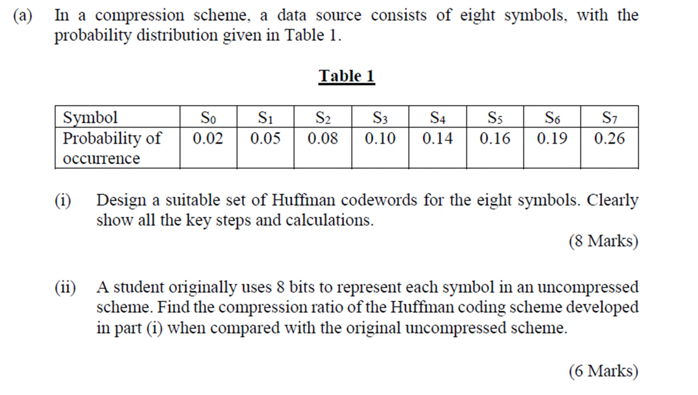

# Image Compression & JPEG Standard

## I. Terms and Concepts

数据压缩或编码（Compression / Coding）的本质目标，在于以尽可能少的比特数完成对特定信息的有效表征，其核心操作是消除数据中存在的统计冗余与感知冗余。

压缩比（Compression Ratio）作为衡量压缩效率的基本度量指标，定义为原始数据量与压缩后数据量之间的比值关系，其数值越高表明数据缩减幅度越大。

信息论为数据压缩奠定了严密的数学基础。其中，香农熵（Shannon Entropy）刻画了无损编码框架下表征离散信源所需的**理论最低平均比特率**，而冗余度则从对立面度量了信源中可供压缩的统计盈余。对于离散信源 $X$，其符号集合为 $\{x_1, x_2, \dots, x_n\}$，各符号出现的概率为 $p(x_i)$，则信源熵定义为：

$$
H(X) = -\sum_{i=1}^{n} p(x_i) \log_2 p(x_i)
$$

$H(X)$ 的量纲为比特/符号。从数学本质上看，该式是对概率分布非均匀程度的全局测度——分布越偏斜，熵值越低，意味着符号间蕴含越多的可预测性与结构性依赖，从而为熵编码（如霍夫曼编码或算术编码）提供越大的压缩空间。为精确刻画此关系，可定义相对冗余度 $R$：

$$
R = 1 - \frac{H(X)}{H_{\max}}, \quad H_{\max} = \log_2 n
$$

当各符号等概率均匀分布（$p(x_i)=1/n$）时，熵达到最大值 $H_{\max}$，此时 $R=0$，信源趋近于完全随机，符号间无任何可利用的统计关联，无损压缩的理论空间趋近于零；反之，当概率分布极度偏斜时，$H(X) \ll H_{\max}$，冗余度 $R \to 1$，表明信源内部存在大量可剔除的统计依赖性，压缩潜力显著。变换域系数通常集中在低频区域且分布不均匀，这为量化和熵编码降低码率提供了理论基础：**量化去除不重要的细节，熵编码则利用数据的概率分布进一步压缩信息。**

## II. Entropy Coding

熵编码是数据压缩体系中无损压缩环节的核心技术，其根本目的在于依据「信源」的统计概率特性，为不同出现频率的符号分配长度不等的码字，从而消除序列内部固有的统计冗余。

霍夫曼（Huffman）编码作为变长编码（VLC）的典型实现，严格遵循“高频短码、低频长码”的分配原则，即对出现概率较高的符号指派长度较短的码字，而对低频符号指派长度较长的码字，通过这种非均匀映射使得编码后的平均码长逼近信源的香农熵，进而实现高效的比特率缩减。

在具体构造机制上，霍夫曼编码通过构建一棵二叉树来完成码字的指派与寻址。该二叉树的拓扑结构包含根节点（Root Node）、分支节点（Branch Node）以及叶节点（Leaf Node），其中每个分支节点均衍生出左、右两条分支，并分别赋予二进制值 0 和 1。

每个待编码的符号最终对应于树中的一个叶节点，其唯一可译的码字由从根节点出发、沿分支路径抵达该叶节点所经过的二进制序列依次串联而成。这种树形结构不仅保证了所生成的码字具备前缀性（即即时码），使得解码端无需依赖额外分隔符即可无歧义地逐符号还原原始序列，同时其构建过程中的概率合并策略也确保了该编码在给定符号概率分布下具有最优的前缀码效率。



```text
每次选取概率最小的两个节点合并

                        [根节点: 1.00]
                       /              \
                      /                \
                    0 /                  \ 1
                    /                      \
               [E: 0.43]                  [F: 0.57]
               /        \                 /        \
              /          \               /          \
            0 /            \ 1         0 /            \ 1
            /              \            /              \
       [S6: 0.19]       [C: 0.24]   [S7: 0.26]       [D: 0.31]
                       /     \                     /     \
                      /       \                   /       \
                    0 /         \ 1             0 /         \ 1
                    /           \                /           \
               [S3: 0.10]   [S4: 0.14]       [B: 0.15]    [S5: 0.16]
                                            /     \
                                           /       \
                                         0 /         \ 1
                                         /           \
                                    [A: 0.07]     [S2: 0.08]
                                    /     \
                                   /       \
                                 0 /         \ 1
                                 /           \
                            [S0: 0.02]   [S1: 0.05]
```

加权平均码长 $\bar{L}$ 为各符号概率与对应码长乘积之和

## III. Image & Video Compression Basics

图像与视频压缩的根本动因在于：
- 一是海量多媒体数据对存储容量的巨大需求
- 二是有限网络带宽对实时传输的制约。未经压缩的数字视频（如 part-1.md 所述 640×480@30fps 原始数据率高达 221 Mbps）在消费级网络中几乎不可传输，这决定了压缩编码在视频应用中的基础性地位。

图像与视频在数据中广泛存在两类可被利用的冗余。第一类是统计冗余，它源于信号本身的数值分布规律。
- **空间冗余（Spatial Redundancy）**，指同一帧图像内相邻像素之间存在极强的统计相关性
- **时间冗余（Temporal Redundancy）**，见于视频序列中，指相邻帧之间因物体运动或场景缓变而产生的像素相似性
- **编码冗余（Coding Redundancy）**，聚焦于信息表示层面本身。其核心理念在于，若符号的码字长度与其出现概率不匹配（即未遵循信息论最优分配原则），则存在冗余

第二类是心理视觉冗余（Psychovisual Redundancy），它根植于人类视觉系统（HVS）的生理感知特性，而非数据本身的统计属性。
- **频率掩蔽（Frequency Masking）**：人眼对图像中高频细节（如纹理、锐利边缘）的失真或噪声不敏感，而对低频平滑区域的变化则极为警觉
- **色彩掩蔽（Color Masking）**：人眼对亮度（Luminance）变化的敏感度远高于对色度（Chrominance）变化的敏感度

基于上述两种冗余的利用策略，压缩技术分流为两大分支：

- **无损压缩（Lossless Compression）**：完全利用统计冗余（空间/时间预测与熵编码），重构图像与原始图像在数值上严格一致。由于其必须保留全部信息，压缩比通常较低（约 2:1 至 3:1），主要应用于不允许任何失真的领域，如医学影像（X 光、CT）、法律证据。
- **有损压缩（Lossy Compression）**：在利用统计冗余的基础上，主动丢弃心理视觉冗余中不敏感的部分信息（如高频细节和色度信息）。这允许其获得远高于无损压缩的压缩比（如 JPEG 可达 10:1 以上，视频编码可达 100:1 以上），但代价是重构图像在数值上与原始图像存在偏差。

最后，为了客观评估有损压缩引入的失真程度，压缩领域引入了统一的失真度量体系。
- 最基础的指标为**均方误差（Mean Squared Error，MSE）**，定义为 $\sigma_d^2 = \frac{1}{N} \sum_{n=1}^N (x_n - y_n)^2$，其中 $x_n$ 与 $y_n$ 分别为原始与重构信号序列，$N$ 为序列长度，该值直接量化了重建误差的能量大小。
- 基于 MSE，进一步衍生出**信噪比（Signal to Noise Ratio，SNR）**，即 $\text{SNR} = 10 \log_{10} \frac{\sigma_x^2}{\sigma_d^2}$（其中 $\sigma_x^2$ 为原始信号的平均功率）
- 以及图像编码中最广泛采用的**峰值信噪比（Peak Signal to Noise Ratio，PSNR）**，定义为 $\text{PSNR} = 10 \log_{10} \frac{x_{\text{peak}}^2}{\sigma_d^2}$（其中 $x_{\text{peak}}$ 为信号可能取的最大幅值，对于 8 位图像即为 255）。PSNR 以对数分贝（dB）为单位，值越高表明失真越小、重建质量越高

## IV. Transform-based Coding / Compression

基于变换的图像压缩框架，其核心设计哲学在于通过将空间域信号映射至变换域，使数据的能量分布与统计特性发生根本性的重构，从而显著提升后续量化与编码环节的效率。

该方案之所以具备工程上的优越性，主要源于变换操作所具有的两个关键数学属性：
- 其一是**能量压缩**（Energy Compaction），即原始图像中绝大部分能量被集中至极少数的低频变换系数上，而高频系数幅值趋近于零
- 其二是**去相关**（Redundancy Reduction），即变换域内各系数之间的统计相关性大幅降低，接近相互独立。

在实际编码系统中，变换压缩的完整流程可分解为明确的闭环链路。
- 在编码端，输入图像首先被分割为固定尺寸的子块（如 $n \times n$），这一分块策略既适应常见变换（如 DCT）的基函数局部性，也有利于并行处理与内存管理；
- 随后对每个子块施加正向变换，将像素值转换为一组变换系数；
- 继而对系数执行量化，完成从连续幅值到离散符号的映射；
- 最后通过熵编码将符号序列转化为压缩比特流。解码端则严格对称，依次执行熵解码、逆量化与逆变换，最终将各子块拼接还原为完整图像。整个系统以**量化器**为唯一不可逆环节，压缩带来的全部失真均源于此，而其余环节均为无损操作。


针对**量化这一核心有损环节**：
- 在标量量化框架下，均匀量化器根据输出重建电平是否包含零值级，可区分为 **Midrise** 与 **Midtread** 两种典型结构。Midrise 型量化器的重建电平对称分布于零值两侧，其输入–输出映射曲线在零附近发生跳跃，不产生精确的零输出，因此更适合处理幅值分布偏置较大的交流系数（如 DCT 的高频分量），因为这类系数的统计均值通常为零且无显著的零值偏好。
- 相比之下，Midtread 型量化器在零值区间内设置了一个包含零的重建电平，即当输入绝对值小于某一阈值时，输出强制归零，这相当于在量化过程中引入了一个“死区”（Dead Zone）。鉴于变换域中大量高频系数在量化前已具有趋近于零的幅值，Midtread 结构能够将这些系数系统性地清零，从而大幅提升系数序列中零值的游程长度，为后续的熵编码（如游程编码配合霍夫曼编码）创造极为有利的统计条件。

因此，在实际图像与视频编码标准（如 JPEG 的 AC 系数量化及 H.264 的变换量化）中，广泛采用的正是带有死区的 Midtread 型均匀量化策略。

量化步骤完成后，输出的离散符号序列进入熵编码阶段。熵编码通过变长编码（VLC）策略，依据各符号出现的先验概率分配不同长度的码字「**高频出现的事件被授予短码，低频出现的事件则被授予长码**」，从而使平均码长逼近信源的香农熵限，实现统计冗余的最终消除。

DCT 变换、带死区的 Midtread 量化与霍夫曼编码三者之间的协同配合，共同构成了 JPEG 等经典压缩标准的底层技术支柱：变换负责重构信息表征形态，量化在感知容限内有选择地丢弃不显著的细节，而熵编码则无损地压缩量化后残存的统计规律。

## V. Discrete Cosine Transform (DCT)

## VI. JPEG Standard

## VII. New & Emerging Directions

## References

- Ze-Nian Li, Mark S. Drew, Jiangchuan Liu, *Fundamentals of Multimedia*, Springer, 2022.
- R. C. Gonzalez and R. E. Woods, *Digital Image Processing*, 4th edition, Pearson, 2018.
- Saeed Vaseghi, *Multimedia Signal Processing*, Wiley, 2007.
- Fred Halsall, *Multimedia Communications: Applications, Networks, Protocols and Standards*, Addison-Wesley, 2001.
- Yun Q. Shi and Huifang Sun, *Image and Video Compression for Multimedia Engineering: Fundamentals, Algorithms, and Standards*, CRC Press, 2000.
- Johannes Ballé, Valero Laparra, and Eero P. Simoncelli, "End-to-End Optimized Image Compression," *Proceedings of the International Conference on Learning Representations (ICLR)*, Toulon, France, pp. 1–27, 2017.
- Chen-Hsiu Huang and Ja-Ling Wu, "Unveiling the Future of Human and Machine Coding: A Survey of End-to-End Learned Image Compression," *Entropy*, vol. 26, no. 5, pp. 357–401, May 2024.
- João Ascenso, "JPEG AI: The First International Standard for Image Coding Based on an End-to-End Learning-Based Approach," *5th International Conference on Image Processing and Vision Engineering (IMPROVE 2025)*, Porto, Portugal, April 2025.