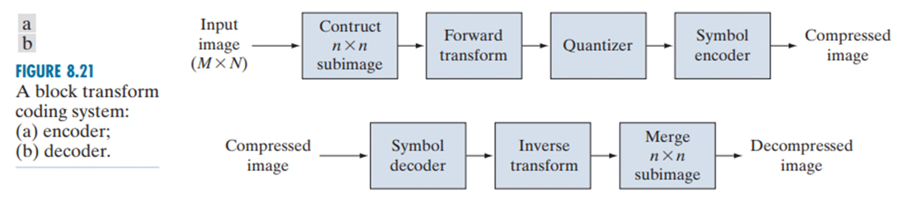
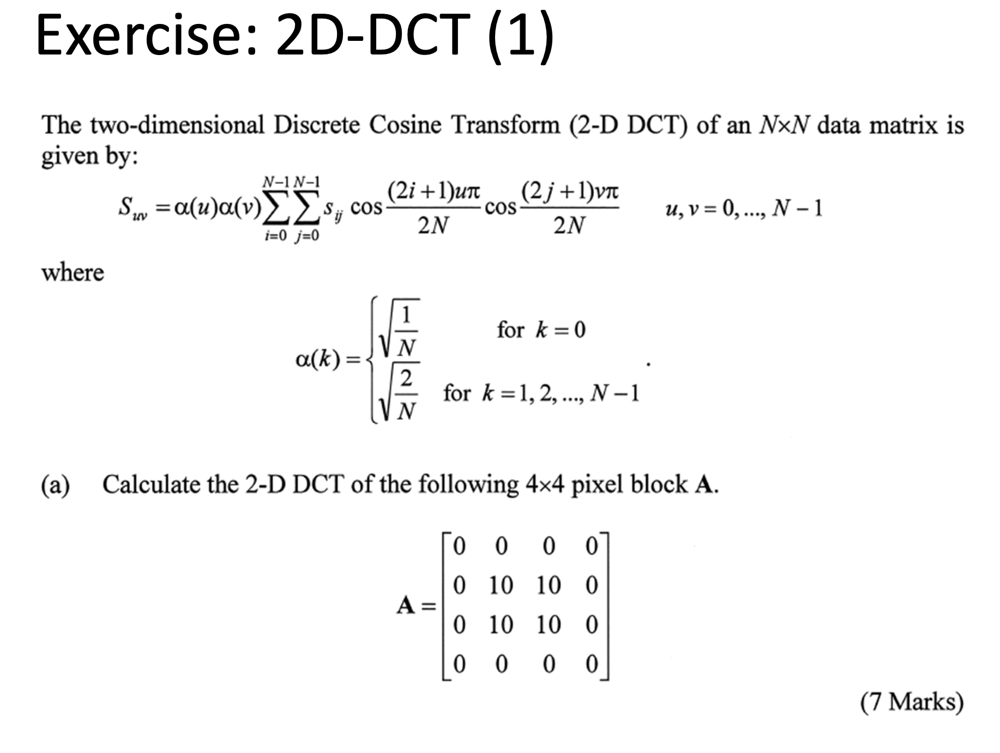
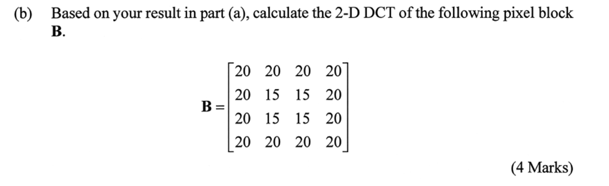
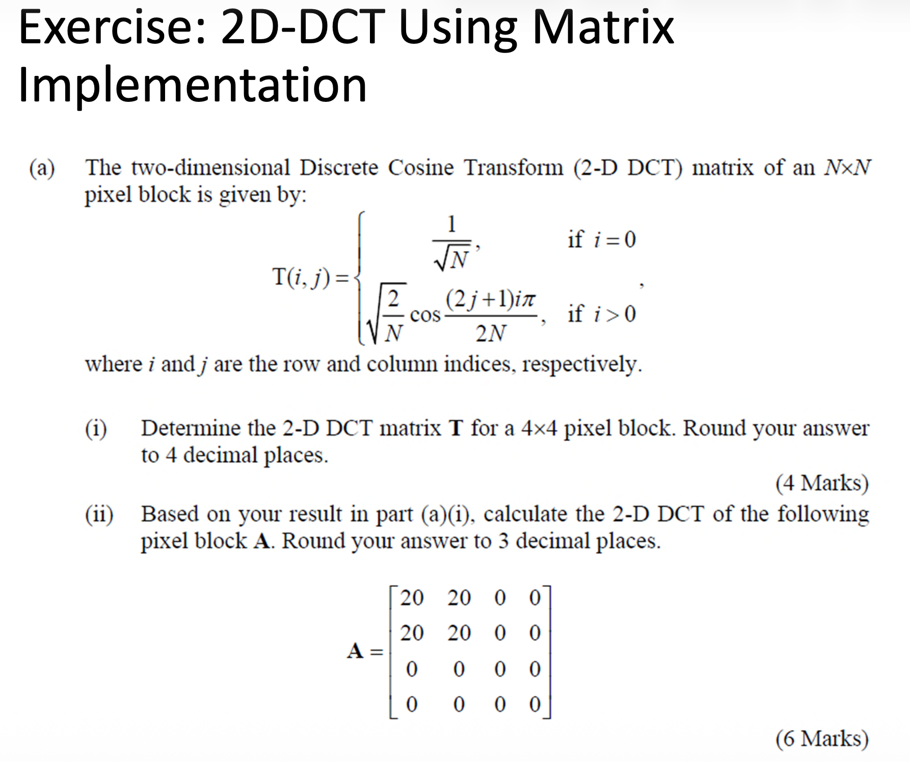
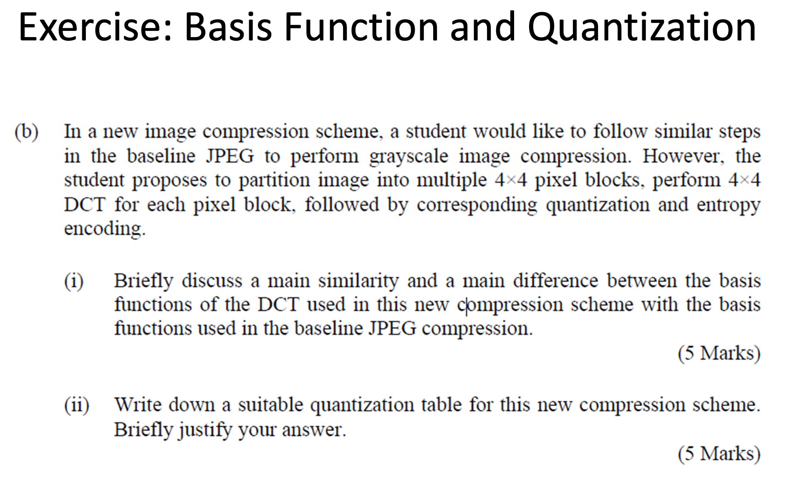

# Image Compression & JPEG Standard

## I. Terms and Concepts

数据压缩或编码（Compression / Coding）的本质目标，在于以尽可能少的比特数完成对特定信息的有效表征，其核心操作是消除数据中存在的统计冗余与感知冗余。

压缩比（Compression Ratio）作为衡量压缩效率的基本度量指标，定义为原始数据量与压缩后数据量之间的比值关系，其数值越高表明数据缩减幅度越大。

信息论为数据压缩奠定了严密的数学基础。其中，香农熵（Shannon Entropy）刻画了无损编码框架下表征离散信源所需的**理论最低平均比特率**，而冗余度则从对立面度量了信源中可供压缩的统计盈余。对于离散信源 $X$，其符号集合为 $\{x_1, x_2, \dots, x_n\}$，各符号出现的概率为 $p(x_i)$，则信源熵定义为：

$$
H(X) = -\sum_{i=1}^{n} p(x_i) \log_2 p(x_i)
$$

$H(X)$ 的量纲为比特/符号。从数学本质上看，该式是对概率分布非均匀程度的全局测度——分布越偏斜，熵值越低，意味着符号间蕴含越多的可预测性与结构性依赖，从而为熵编码（如霍夫曼编码或算术编码）提供越大的压缩空间。为精确刻画此关系，可定义相对冗余度 $R$：

$$
R = 1 - \frac{H(X)}{H_{\max}}, \quad H_{\max} = \log_2 n
$$

当各符号等概率均匀分布（$p(x_i)=1/n$）时，熵达到最大值 $H_{\max}$，此时 $R=0$，信源趋近于完全随机，符号间无任何可利用的统计关联，无损压缩的理论空间趋近于零；反之，当概率分布极度偏斜时，$H(X) \ll H_{\max}$，冗余度 $R \to 1$，表明信源内部存在大量可剔除的统计依赖性，压缩潜力显著。变换域系数通常集中在低频区域且分布不均匀，这为量化和熵编码降低码率提供了理论基础：**量化去除不重要的细节，熵编码则利用数据的概率分布进一步压缩信息。**

## II. Entropy Coding

熵编码是数据压缩体系中无损压缩环节的核心技术，其根本目的在于依据「信源」的统计概率特性，为不同出现频率的符号分配长度不等的码字，从而消除序列内部固有的统计冗余。

霍夫曼（Huffman）编码作为变长编码（VLC）的典型实现，严格遵循“高频短码、低频长码”的分配原则，即对出现概率较高的符号指派长度较短的码字，而对低频符号指派长度较长的码字，通过这种非均匀映射使得编码后的平均码长逼近信源的香农熵，进而实现高效的比特率缩减。

在具体构造机制上，霍夫曼编码通过构建一棵二叉树来完成码字的指派与寻址。该二叉树的拓扑结构包含根节点（Root Node）、分支节点（Branch Node）以及叶节点（Leaf Node），其中每个分支节点均衍生出左、右两条分支，并分别赋予二进制值 0 和 1。

每个待编码的符号最终对应于树中的一个叶节点，其唯一可译的码字由从根节点出发、沿分支路径抵达该叶节点所经过的二进制序列依次串联而成。这种树形结构不仅保证了所生成的码字具备前缀性（即即时码），使得解码端无需依赖额外分隔符即可无歧义地逐符号还原原始序列，同时其构建过程中的概率合并策略也确保了该编码在给定符号概率分布下具有最优的前缀码效率。


```text
每次选取概率最小的两个节点合并

                        [根节点: 1.00]
                       /              \
                      /                \
                    0 /                  \ 1
                    /                      \
               [E: 0.43]                  [F: 0.57]
               /        \                 /        \
              /          \               /          \
            0 /            \ 1         0 /            \ 1
            /              \            /              \
       [S6: 0.19]       [C: 0.24]   [S7: 0.26]       [D: 0.31]
                       /     \                     /     \
                      /       \                   /       \
                    0 /         \ 1             0 /         \ 1
                    /           \                /           \
               [S3: 0.10]   [S4: 0.14]       [B: 0.15]    [S5: 0.16]
                                            /     \
                                           /       \
                                         0 /         \ 1
                                         /           \
                                    [A: 0.07]     [S2: 0.08]
                                    /     \
                                   /       \
                                 0 /         \ 1
                                 /           \
                            [S0: 0.02]   [S1: 0.05]
```

加权平均码长 $\bar{L}$ 为各符号概率与对应码长乘积之和

## III. Image & Video Compression Basics

图像与视频压缩的根本动因在于：
- 一是海量多媒体数据对存储容量的巨大需求
- 二是有限网络带宽对实时传输的制约。未经压缩的数字视频（如 part-1.md 所述 640×480@30fps 原始数据率高达 221 Mbps）在消费级网络中几乎不可传输，这决定了压缩编码在视频应用中的基础性地位。

图像与视频在数据中广泛存在两类可被利用的冗余。第一类是统计冗余，它源于信号本身的数值分布规律。
- **空间冗余（Spatial Redundancy）**，指同一帧图像内相邻像素之间存在极强的统计相关性
- **时间冗余（Temporal Redundancy）**，见于视频序列中，指相邻帧之间因物体运动或场景缓变而产生的像素相似性
- **编码冗余（Coding Redundancy）**，聚焦于信息表示层面本身。其核心理念在于，若符号的码字长度与其出现概率不匹配（即未遵循信息论最优分配原则），则存在冗余

第二类是心理视觉冗余（Psychovisual Redundancy），它根植于人类视觉系统（HVS）的生理感知特性，而非数据本身的统计属性。
- **频率掩蔽（Frequency Masking）**：人眼对图像中高频细节（如纹理、锐利边缘）的失真或噪声不敏感，而对低频平滑区域的变化则极为警觉
- **色彩掩蔽（Color Masking）**：人眼对亮度（Luminance）变化的敏感度远高于对色度（Chrominance）变化的敏感度

基于上述两种冗余的利用策略，压缩技术分流为两大分支：

- **无损压缩（Lossless Compression）**：完全利用统计冗余（空间/时间预测与熵编码），重构图像与原始图像在数值上严格一致。由于其必须保留全部信息，压缩比通常较低（约 2:1 至 3:1），主要应用于不允许任何失真的领域，如医学影像（X 光、CT）、法律证据。
- **有损压缩（Lossy Compression）**：在利用统计冗余的基础上，主动丢弃心理视觉冗余中不敏感的部分信息（如高频细节和色度信息）。这允许其获得远高于无损压缩的压缩比（如 JPEG 可达 10:1 以上，视频编码可达 100:1 以上），但代价是重构图像在数值上与原始图像存在偏差。

最后，为了客观评估有损压缩引入的失真程度，压缩领域引入了统一的失真度量体系。
- 最基础的指标为**均方误差（Mean Squared Error，MSE）**，定义为 $\sigma_d^2 = \frac{1}{N} \sum_{n=1}^N (x_n - y_n)^2$，其中 $x_n$ 与 $y_n$ 分别为原始与重构信号序列，$N$ 为序列长度，该值直接量化了重建误差的能量大小。
- 基于 MSE，进一步衍生出**信噪比（Signal to Noise Ratio，SNR）**，即 $\text{SNR} = 10 \log_{10} \frac{\sigma_x^2}{\sigma_d^2}$（其中 $\sigma_x^2$ 为原始信号的平均功率）
- 以及图像编码中最广泛采用的**峰值信噪比（Peak Signal to Noise Ratio，PSNR）**，定义为 $\text{PSNR} = 10 \log_{10} \frac{x_{\text{peak}}^2}{\sigma_d^2}$（其中 $x_{\text{peak}}$ 为信号可能取的最大幅值，对于 8 位图像即为 255）。PSNR 以对数分贝（dB）为单位，值越高表明失真越小、重建质量越高

## IV. Transform-based Coding / Compression

基于变换的图像压缩框架，其核心设计哲学在于通过将空间域信号映射至变换域，使数据的能量分布与统计特性发生根本性的重构，从而显著提升后续量化与编码环节的效率。

该方案之所以具备工程上的优越性，主要源于变换操作所具有的两个关键数学属性：
- 其一是**能量压缩**（Energy Compaction），即原始图像中绝大部分能量被集中至极少数的低频变换系数上，而高频系数幅值趋近于零
- 其二是**去相关**（Redundancy Reduction），即变换域内各系数之间的统计相关性大幅降低，接近相互独立。几乎不影响压缩效率

在实际编码系统中，变换压缩的完整流程可分解为明确的闭环链路。
- **图像分块（Partitioning）**：在编码端，输入图像（尺寸为 $M \times N$）被分割为若干固定大小的方形子块（如 JPEG 中的 $8 \times 8$ 像素块），旨在降低变换的运算复杂度并使算法适配局部的图像统计特性
- **变换（Transform）**：随后，对每个子块进行前向变换，将其由空间域映射至变换域，得到一组变换系数。由于图像能量主要集中于低频成分，左上角低频区域的系数能量较为集中，而右下角高频区域的系数幅值通常较小。
- **量化（Quantization）**：继而对系数执行量化，完成从连续幅值到离散符号的映射；
- **编码（Coding）**：最后通过熵编码将符号序列转化为压缩比特流。解码端则严格对称，依次执行熵解码、逆量化与逆变换，最终将各子块拼接还原为完整图像。整个系统以**量化器**为唯一不可逆环节，压缩带来的全部失真均源于此，而其余环节均为无损操作。

> :bulb: 变换环节中，**离散余弦变换（Discrete Cosine Transform，DCT）** 因其接近最优的克拉美-罗下界（Karhunen-Loève Transform，KLT）的去相关能力以及基于快速算法的低计算复杂度，成为 JPEG、MPEG 及 H.26x 系列标准的实际选择。此外，离散傅里叶变换（DFT）与离散小波变换（DWT）也在特定应用场景中各自发挥优势



量化是系统中唯一引入不可逆信息损失的环节，其实质为一种**多对一映射（Many-to-One Mapping）**。

- 它将连续取值或高精度离散取值的变换系数映射为有限数量的符号（即量化级别），通过舍入或截断操作降低数值精度。以 **均匀标量量化（Uniform Scalar Quantization）** 为例，其根据量化步长（Step Size）将实数轴划分为等间隔区间，每个区间内的所有输入值统一映射为同一输出值。
- 依据量化器零区间（Zero-bin）设计的不同，均匀量化器可分为 **中点上升（Midrise）**与**中点平顶（Midtread）** 两种典型结构：
    - 前者在零值附近无零区间（即零值系数会被量化至正或负的第一级），输出不含明确的零电平，适用于对零值非敏感的系数分布；
    - 后者则包含关于原点对称的零区间（即幅值小于半步长的系数均被映射为零），这种设计更能利用变换系数集中于零值附近的统计分布特征，有助于大幅提升后续熵编码的压缩效率。

量化步长直接决定了压缩比与重建质量之间的工程化平衡。步长越大，系数被压缩至零的数量越多，数据量缩减越显著，但引入的失真也相应增大。

编码作为系统末端环节，负责为量化后的每个符号分配对应的二进制码字（Codeword）。该阶段可采用固定长度编码或变长编码（Variable Length Coding，VLC）。其中，熵编码依据符号出现的概率分配码字长度——高频符号（出现概率大）分配较短码字，低频符号分配较长码字，从而最小化平均码长。霍夫曼编码正是此类变长编码的典型实现，共同构成了从统计冗余消除到最终比特流生成的核心路径。

> :bulb: 综上，变换编码的工程哲学可归纳为：**变换集中能量、量化丢弃不敏感信息、编码消除统计残余**。三者构成层次清晰、职责分明的信号处理链路，所有主流静态图像与视频压缩标准（JPEG、MPEG、H.26x 等）均遵循这一通用架构，区别仅在于具体变换内核、量化策略与熵编码方案的选择与优化。

## V. Discrete Cosine Transform (DCT)

离散余弦变换（Discrete Cosine Transform, DCT）在现代图像与视频压缩标准（如 JPEG、MPEG 及 H.26x 系列）中占据核心地位，其根本任务在于将空间域的像素信号映射至频域，使图像能量在变换域中获得最紧凑的分布形式。对于大小为 $N \times N$ 的图像块，二维 DCT 的数学定义为：

$$
S_{uv} = \alpha(u)\alpha(v)\sum_{i=0}^{N-1}\sum_{j=0}^{N-1} s_{ij} \cos\left(\frac{(2i+1)u\pi}{2N}\right) \cos\left(\frac{(2j+1)v\pi}{2N}\right), \quad u, v = 0, 1, \dots, N-1
$$


其中 $s_{ij}$ 为空间域像素值（坐标为 $i, j$），$S_{uv}$ 为变换域系数（坐标为 $u, v$），而 $\alpha(k)$ 为归一化因子，定义为：

$$
\alpha(k) =
\begin{cases} 
\sqrt{1/N}, & k = 0 \\
\sqrt{2/N}, & k \neq 0
\end{cases}
$$

该变换具有可分离性：二维变换可分解为两个连续的一维变换（先对行、再对列），这种分离特性为快速算法（快速 DCT，即 FDCT）的工程实现提供了基础，使得 DCT 在硬件部署中具备极高的计算效率。

从线性代数的视角看，DCT 的实质是**基函数的转换**（Change of Basis），它将输入图像块视为一组固定且与图像内容无关的正交基函数的加权线性组合。这些基函数的物理意义极为直观
- 左上角的基函数（对应 $u=0, v=0$）表现为全平面恒定亮度，称为直流（DC）分量，它捕获了图像块的平均亮度；
- 向右移动（$u$ 增大）意味着基函数沿水平方向振荡频率升高，向下移动（$v$ 增大）则意味着垂直方向振荡频率升高，而右下角则对应水平与垂直方向均最高的纹理细节成分。

这种“乐高积木”（Lego Functions）式的分解视角揭示了 DCT 的本质：变换系数 $S_{uv}$ 量化了图像中每一种空间频率模式所占的权重。

DCT 在压缩中的优势在于 **能量集中（Energy Compaction）** 特性。对于自然图像块，由于相邻像素间的高度相关性，变换后大部分能量将坍缩至低频率系数（左上角），而大量高频系数（右下角）的幅值趋近于零。这种分布规律将空间域中分散的像素能量重新排列，使后续的量化操作能够以较少的符号承载信号主体，并利用高频系数取整为零的统计特征提升熵编码效率。

此外，变换本身为**线性一一映射**且完全**可逆**（在未引入舍入误差的前提下），这意味着变换环节自身不引入任何失真，其性质与量化环节形成鲜明互补。

> :bulb: 虽然 Karhunen-Loève 变换（KLT）在去相关性与能量集中方面理论上最优，但其基函数依赖于图像的具体统计特性且需随块变化，缺乏普适性与快速算法；而 DCT 凭借其**固定的、与图像内容无关的正交基**以及近乎最优的去相关能力，在压缩效率与工程可实现性之间取得了平衡

### A. 例题 1



对于 $N \times N$ 的图像块（此处 $N=4$），二维 DCT 定义为：

$$
S_{uv} = \alpha(u)\alpha(v) \sum_{i=0}^{3}\sum_{j=0}^{3} s_{ij}
\cos\!\left(\frac{(2i+1)u\pi}{8}\right)
\cos\!\left(\frac{(2j+1)v\pi}{8}\right),
\quad u,v=0,1,2,3
$$

其中归一化系数  
$$
\alpha(0)=\frac{1}{2},\quad \alpha(1)=\alpha(2)=\alpha(3)=\frac{1}{\sqrt{2}}.
$$

A 具有对称性，且只有第 1、2 行（从 0 开始计数）非零且相同。利用**可分离性**：先对每行做一维 DCT（未归一化），再对每列做一维 DCT，最后乘以 $\alpha(u)\alpha(v)$。

定义一维变换（不加 $\alpha$）：

$$
Y_u = \sum_{i=0}^{3} x_i \cos\left(\frac{(2i+1)u\pi}{8}\right)
$$

行向量 $x = [0, 10, 10, 0]$。计算得到：

- $u=0$：$Y_0 = 10(1+1) = 20$
- $u=1$：$Y_1 = 10(\cos 3\pi/8 + \cos 5\pi/8) = 10(0.3827 - 0.3827) = 0$
- $u=2$：$Y_2 = 10(\cos 3\pi/4 + \cos 5\pi/4) = 10(-\sqrt{2}/2 - \sqrt{2}/2) = -10\sqrt{2}$
- $u=3$：$Y_3 = 10(\cos 9\pi/8 + \cos 15\pi/8) = 10(-0.9239 + 0.9239) = 0$

因此，行变换结果为 $[20,\ 0,\ -10\sqrt{2},\ 0]$。

由于 A 只有第 1、2 行为此向量，其余行为全零，得到中间矩阵 $M$（行索引为 u，列索引为 j）：

$$
M = \begin{bmatrix}
0 & 0 & 0 & 0 \\
20 & 0 & -10\sqrt{2} & 0 \\
20 & 0 & -10\sqrt{2} & 0 \\
0 & 0 & 0 & 0
\end{bmatrix}
$$

对 $M$ 的每一列做同样的一维变换。每一列的向量为 $[0, c, c, 0]$，其中 $c$ 取 $20, 0, -10\sqrt{2}, 0$。

已知对序列 $[0, c, c, 0]$ 的一维变换结果为：

$$
[2c,\ 0,\ -c\sqrt{2},\ 0]
$$

（可类比上一步，只是将 10 换为 $c$）。

于是：

- 列 0（$c=20$）：$[40,\ 0,\ -20\sqrt{2},\ 0]$
- 列 1（$c=0$）：全零
- 列 2（$c=-10\sqrt{2}$）：$[ -20\sqrt{2},\ 0,\ 20,\ 0]$
- 列 3（$c=0$）：全零

将结果作为新矩阵 $N$ 的列（行索引为 u，列索引为 v）：

$$
N = \begin{bmatrix}
40 & 0 & -20\sqrt{2} & 0 \\
0 & 0 & 0 & 0 \\
-20\sqrt{2} & 0 & 20 & 0 \\
0 & 0 & 0 & 0
\end{bmatrix}
$$

最终 $S_{uv} = \alpha(u)\alpha(v) N_{uv}$。

已知 $\alpha(0)=\frac12,\ \alpha(1)=\alpha(2)=\alpha(3)=\frac{1}{\sqrt{2}}$。

计算非零项：

- $S_{00} = \frac12 \cdot \frac12 \cdot 40 = 10$
- $S_{02} = \frac12 \cdot \frac{1}{\sqrt{2}} \cdot (-20\sqrt{2}) = \frac12 \cdot (-20) = -10$
- $S_{20} = \frac{1}{\sqrt{2}} \cdot \frac12 \cdot (-20\sqrt{2}) = \frac12 \cdot (-20) = -10$
- $S_{22} = \frac{1}{\sqrt{2}} \cdot \frac{1}{\sqrt{2}} \cdot 20 = \frac12 \cdot 20 = 10$

其余为 0。

所以块 A 的 DCT 为：

$$
\boxed{
S_A = \begin{bmatrix}
10 & 0 & -10 & 0 \\
0 & 0 & 0 & 0 \\
-10 & 0 & 10 & 0 \\
0 & 0 & 0 & 0
\end{bmatrix}
}
$$



观察到 B 可表示为全 1 矩阵 $J$ 与块 A 的线性组合：

$$
B = 20J - 0.5A
$$

其中 $J$ 为 $4\times4$ 全 1 矩阵，A 同前。DCT 是线性变换，因此：

$$
S_B = 20 \cdot S_J - 0.5 \cdot S_A
$$

先求 $J$ 的 DCT。由于 $J$ 的所有像素值均为 1，只有直流分量非零：

$$
S_J(0,0) = \alpha(0)^2 \sum_{i=0}^3\sum_{j=0}^3 1 \cdot 1 \cdot 1 = \frac14 \cdot 16 = 4
$$

其余 $S_J(u,v)=0$。

于是：

$$
20S_J = \begin{bmatrix}
80 & 0 & 0 & 0 \\
0 & 0 & 0 & 0 \\
0 & 0 & 0 & 0 \\
0 & 0 & 0 & 0
\end{bmatrix}
$$

而 $-0.5 S_A$ 为：

$$
-0.5 S_A = \begin{bmatrix}
-5 & 0 & 5 & 0 \\
0 & 0 & 0 & 0 \\
5 & 0 & -5 & 0 \\
0 & 0 & 0 & 0
\end{bmatrix}
$$

相加得：

$$
S_B = \begin{bmatrix}
75 & 0 & 5 & 0 \\
0 & 0 & 0 & 0 \\
5 & 0 & -5 & 0 \\
0 & 0 & 0 & 0
\end{bmatrix}
$$

> :bulb: 验证直流分量：B 的像素总和为 $20\times4 + 20\times2?$ 实际计算：第一行 80，第二行 70，第三行 70，第四行 80，总和 300。$S_{00} = \alpha(0)^2 \times 300 = \frac14 \times 300 = 75$，与上式一致。


### B. 例题 2




## VI. JPEG Standard

观察到：

- 图像内容在局部区域内呈现出缓慢变化的特性，尤其在 8×8 像素块范围内，相邻像素间存在高度相关性。
- 人眼视觉系统对高频空间分量的失真敏感度远低于对低频分量的敏感度。 
- 人眼对亮度分量的敏感度显著高于对色度分量的敏感度。

基于上述原理，基线 JPEG（Baseline JPEG）作为最广泛部署的运作模式，遵循一套层次清晰的串行处理流水线：

1. **图像分块与预处理**：将输入图像分割为 8×8 像素块，若尺寸非整数倍则进行填充，并对各分量（Y、Cb、Cr）独立处理。
2. **前向 DCT**：对每个 8×8 像素块施加二维离散余弦变换，将空间域像素值映射为频域系数矩阵。DCT 的去相关性和能量集中特性使得有效信息压缩至少数低频系数，而大量高频系数趋近于零。
3. **量化**：依据 JPEG 标准推荐的亮度与色度量化表，对 DCT 系数进行均匀标量量化。量化步长由品质因子（Quality Factor）控制，是压缩比与重建质量之间的主要调节杠杆。
4. **熵编码**：将量化后的系数矩阵按 Zig-Zag 扫描顺序重新排列（使低频系数优先、高频系数靠后，形成连续的零游程），随后采用霍夫曼编码或算术编码对非零系数及其游程长度进行变长编码，消除统计冗余。
5. **帧构建**：将压缩后的码流按 JPEG 标准格式进行封装，添加必要的标记、量化表、霍夫曼表及头信息，生成最终可存储或传输的 JPEG 文件。

> :bulb: 回顾：为何采用二维离散余弦变换（2D-DCT）？
> - 将图像数据转换为更适合压缩的形式。
> - 2D-DCT 能够实现能量集中（energy compaction）。
> - 2D-DCT 通过降低变换系数间的相关性来减少冗余。

**量化环节**是 JPEG 编码流程中信息损失的唯一步骤，也是压缩比与重建质量之间矛盾的核心交汇点。其本质在于用有限精度的离散符号去表示原本连续分布的 DCT 系数

由于 DCT 输出为实数范围的浮点值，而后续熵编码仅能处理整数符号，量化器必须将这些数值映射至有限的整数集合中。这一映射关系由量化表（Quantization Table） 统一定义，表中每个位置对应一个 DCT 频率分量，其取值即为该频率分量的量化步长。

量化表中的数值体现了 JPEG 对**频率掩蔽效应**的利用。低频分量（包括 DC 分量 $S_{00}$）承载图像的主要能量，人眼对其变化较为敏感，因此采用较小的量化步长，以减少量化误差。高频分量对视觉影响较小，则使用较大的量化步长，允许更大的误差，从而在保证视觉质量的同时有效降低数据量。

量化操作在数学上表现为：$\text{量化值} = \text{round}\left( \frac{\text{DCT 系数}}{\text{量化步长}} \right)$。量化步长越小，保留的系数精度越高，重建图像越接近原始，但压缩比降低；量化步长越大，系数被置零的比例越高，熵编码效率显著提升，但失真加剧。因此，量化表的设计本质上是编码器依据视觉感知模型对“比特分配”策略的优化过程。

JPEG 标准推荐了两套经典的量化表（一套针对亮度分量，一套针对色度分量），其数值分布反映了大量主观视觉实验统计所得的人类感知阈值。实际应用中，用户可通过品质因子（Quality Factor）整体缩放这些步长，进一步在文件大小与画面质量之间做出取舍

### A. 例题 1



**熵编码**环节的启动，标志着 JPEG 编码流程从有损处理阶段正式过渡至无损压缩阶段。该阶段的核心任务在于将经过量化的 DCT 系数矩阵转化为高度紧凑的二进制比特流，其具体实施涵盖四个分工明确的子步骤：矢量化（Zig-zag 扫描）、差分编码（DPCM）、游程编码（RLE）与霍夫曼编码。

**矢量化**作为熵编码的预处理环节，其操作本质是改变数据的组织结构。通过 Z 字形扫描（Zig-zag Scanning），将二维量化系数矩阵按空间频率从低到高的顺序重排为一维序列。这种扫描策略将能量集中（低频系数多位于矩阵左上角）与量化特性（高频系数大量归零）相结合，使得该一维序列中绝大多数非零系数集中在序列前端，而连续的零值则被统一推移至序列尾部

**直流系数的差分编码（DPCM）** 体现了对图像块间统计相关性的利用。由于相邻图像块的平均亮度（即 DC 系数）通常变化平缓，JPEG 并未直接编码当前块的 DC 系数绝对值，而是计算其与前一已编码块 DC 系数的差值（预测残差）并进行编码。这种差分处理将原本取值范围宽广的 DC 系数转化为集中在零值附近的小幅度差值，显著降低了其动态范围和熵值。

**交流系数的游程编码（RLE）** 则专门针对之字形扫描后的高频 AC 系数序列。该编码以二元组 \( (\text{skip}, \text{value}) \) 为基本语法单元，其中 `skip` 表示当前非零系数之前连续零值的个数，`value` 表示该非零系数的幅值。通过将长串的零值抽象为游程长度描述，RLE 有效地压缩了零值占主导地位的高频段，并将序列化简为若干稀疏分布的有意义符号对。

**霍夫曼编码** 作为流水线的最后一道工序，对所有经过差分编码后的 DC 差值以及经过 RLE 处理后的 AC 符号对进行统计建模。依据变长编码（VLC）原则，霍夫曼编码器根据符号出现的频率分配长度不等的码字。高频符号（如零游程长度为零且值为 1 的组合）被映射为仅数比特的短码，而低频符号则被分配较长的码字。这一策略使得整个数据流的平均码长在无损条件下无限逼近信源的理论熵限

在上述熵编码完成后，**帧构建器（Frame Builder）** 将所有编码后的码流与必要的边信息（包括量化表定义、霍夫曼表定义、图像尺寸、采样因子等）按照 JPEG 标准定义的严格语法格式进行封装，生成结构完整的 JPEG 比特流文件，以供存储或网络传输。

> :bulb: 解码过程则是上述流程的严格逆操作。**JPEG 解码器** 首先从比特流头部解析并提取出霍夫曼表和量化表，随后对主体码流依次执行霍夫曼解码（还原出差分值及 \( (\text{skip}, \text{value}) \) 对）、差分解码（还原出 DC 系数绝对值）及游程解码（还原出完整的 AC 系数序列），进而重构出完整的 DCT 系数矩阵。此后，解码器利用从比特流中提取的量化表对系数矩阵进行**反量化（Dequantization）**，将整数值还原至近似原始的频域幅值范围；最后执行**逆离散余弦变换（IDCT）**，将频域矩阵变换回空间域的像素块。这些像素块最终被图像构建器按原始空间位置拼接，从而完成整幅图像的重建。

## VII. New & Emerging Directions

长期以来，以 JPEG、MPEG 及 H.26x 系列为代表的传统图像与视频压缩标准，建立在**手工设计的线性变换（如 DCT）、固定量化策略与熵编码**的基础之上。这类“人工设计型压缩”（Hand-crafted Compression）经过数十年演进，其算法成熟度、硬件生态与标准化程度均已达到高度完备的水平。然而：

- **变换基固定**：DCT 等线性变换的基函数与图像内容无关，对非平稳、非规则纹理区域的能量集中效率存在天花板；
- **失真度量单一**：通常以 MSE/PSNR 为优化目标，难以直接反映人眼主观感知质量；
- **编码与任务割裂**：压缩过程与下游视觉任务（如检测、分割）相互独立，无法实现信息保真度与任务精度之间的协同优化。

上述瓶颈催生了**学习型压缩（Learning-based Compression）** 这一新兴范式。该方向以**端到端神经网络**为核心工具，将整个压缩系统视为一个可微分的联合优化问题

相比传统压缩方案，学习型压缩在以下三个维度展现出显著优势：

1. **表示学习的适应性**：神经网络通过**分析变换（Analysis Transform）** 将图像映射至**隐空间（Latent Space）**，该映射并非预先固定的数学形式，而是从大规模数据分布中自适应学得的非线性变换。该过程能够更紧凑地捕获图像的结构信息，其压缩表示效率超越了 DCT 等固定基变换。

2. **灵活的失真目标函数**：传统压缩依赖 MSE/PSNR 等客观指标，而学习型框架可轻松嵌入**感知损失（Perceptual Loss）**、生成对抗网络（GAN） 或 MS-SSIM 等更贴近人眼视觉质量的损失函数。这使得低码率下的重建图像在主观视觉上更加真实自然，而非仅追求像素级别的数值逼近。

3. **面向机器视觉的编码**：学习型压缩支持编码器与下游视觉任务（目标检测、语义分割、人脸识别等）进行**联合训练**，从而在比特流层面直接保留对机器任务最有用的语义特征。这种从“面向人眼编码”到“面向机器编码”的范式转移，正在重塑压缩编码的功能定位。

为了将学习型压缩从学术研究推向工业应用，国际标准化组织 JPEG 委员会于 2019 年启动了 **JPEG AI 项目（ISO/IEC 6048）**，其目标为制定首个基于学习的图像压缩国际标准。JPEG AI 的核心定位可概括为“**一流多用途**”（One Stream, Multiple Purposes），其设计目标同时覆盖：

- **人类视觉**：提供主观质量优异的图像重建；
- **机器视觉**：支持压缩域内的图像处理与计算机视觉任务，无需完全解码即可完成分析；
- **免版税基线**：确保标准的广泛可采纳性。

在应用场景层面，JPEG AI 面向图像采集与存储、媒体分发、云存储、视觉监控、自动驾驶及实时视觉数据监测等广泛领域，其技术框架不再局限于传统“存储—传输—显示”的线性链条，而是深度融入智能视觉系统全链路。

尽管学习型压缩的底层实现基于神经网络，但其**高层系统逻辑仍遵循经典压缩架构**：编码器将图像转换为压缩表示，经量化与熵编码生成比特流，解码器由比特流重建图像。关键在于各模块的实现方式发生了根本变革：

- **隐空间表示（Latent Representation）**：传统方案在像素域或 DCT 域操作，而学习型编码器通过**分析变换**将图像映射至低维隐空间。该隐空间表示比像素域更为紧凑，且其统计分布可通过神经网络显式建模。

- **概率模型（Entropy Model）**：为了实现高效的熵编码，神经编解码器需要**训练一个概率模型 \( P \)** 来精确拟合量化后变换系数的分布。该概率模型被用于算术编码（或类似熵编码器）中以逼近理论熵限，是学习型压缩在率失真性能上超越传统方案的关键要素之一。

- **端到端联合优化**：这是与传统流水线最本质的区别。在神经编解码器中，分析变换、量化、概率建模、合成变换（Synthesis Transform）等模块不再孤立设计，而是**作为一个整体系统进行全局优化**。这种端到端训练使得各组件能够相互协同适应，而非各自为政的级联最优。

**典型神经编解码器的工作流程**可概括为：输入图像 → 分析变换 → 隐空间表示 → 量化 → 概率估计 → 熵编码 → 比特流 → 熵解码 → 合成变换 → 重建图像。整个链路高度对称，与 JPEG 的变换—量化—编码架构在抽象逻辑层面保持一致，但在具体实现上以神经网络替代了手工设计的数学运算。

## References

- Ze-Nian Li, Mark S. Drew, Jiangchuan Liu, *Fundamentals of Multimedia*, Springer, 2022.
- R. C. Gonzalez and R. E. Woods, *Digital Image Processing*, 4th edition, Pearson, 2018.
- Saeed Vaseghi, *Multimedia Signal Processing*, Wiley, 2007.
- Fred Halsall, *Multimedia Communications: Applications, Networks, Protocols and Standards*, Addison-Wesley, 2001.
- Yun Q. Shi and Huifang Sun, *Image and Video Compression for Multimedia Engineering: Fundamentals, Algorithms, and Standards*, CRC Press, 2000.
- Johannes Ballé, Valero Laparra, and Eero P. Simoncelli, "End-to-End Optimized Image Compression," *Proceedings of the International Conference on Learning Representations (ICLR)*, Toulon, France, pp. 1–27, 2017.
- Chen-Hsiu Huang and Ja-Ling Wu, "Unveiling the Future of Human and Machine Coding: A Survey of End-to-End Learned Image Compression," *Entropy*, vol. 26, no. 5, pp. 357–401, May 2024.
- João Ascenso, "JPEG AI: The First International Standard for Image Coding Based on an End-to-End Learning-Based Approach," *5th International Conference on Image Processing and Vision Engineering (IMPROVE 2025)*, Porto, Portugal, April 2025.